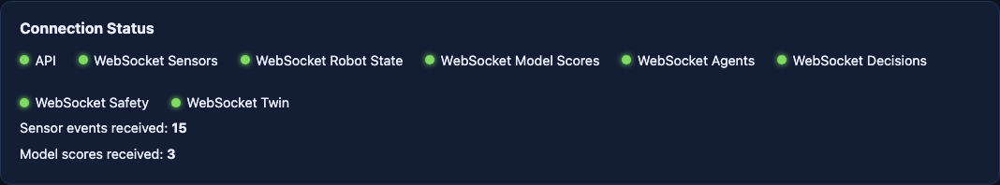
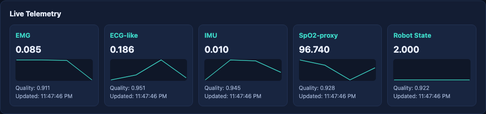
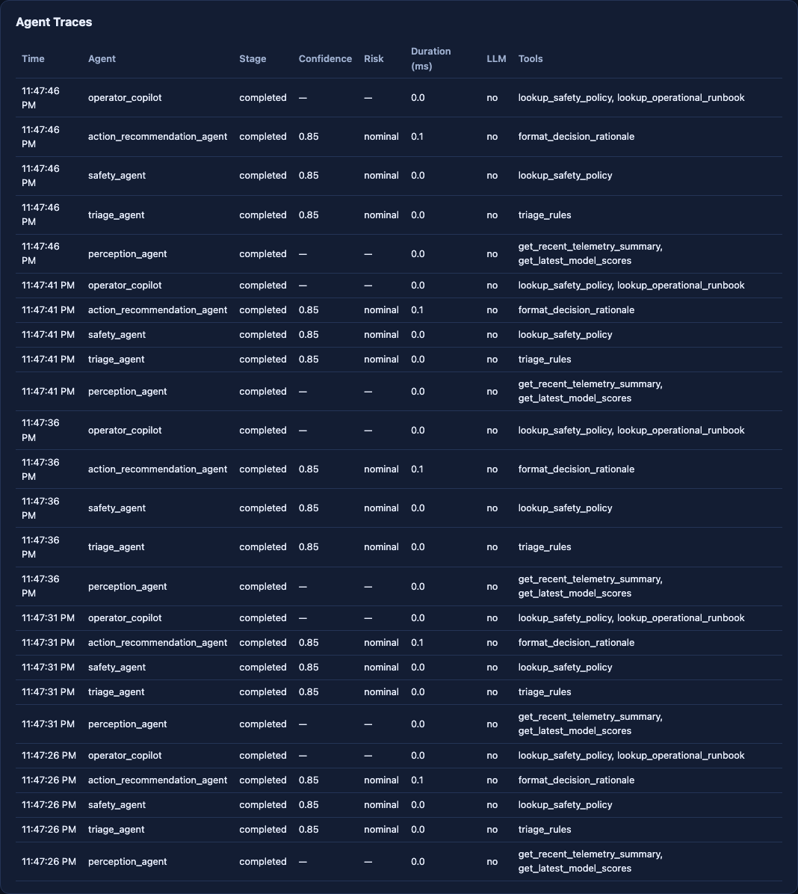
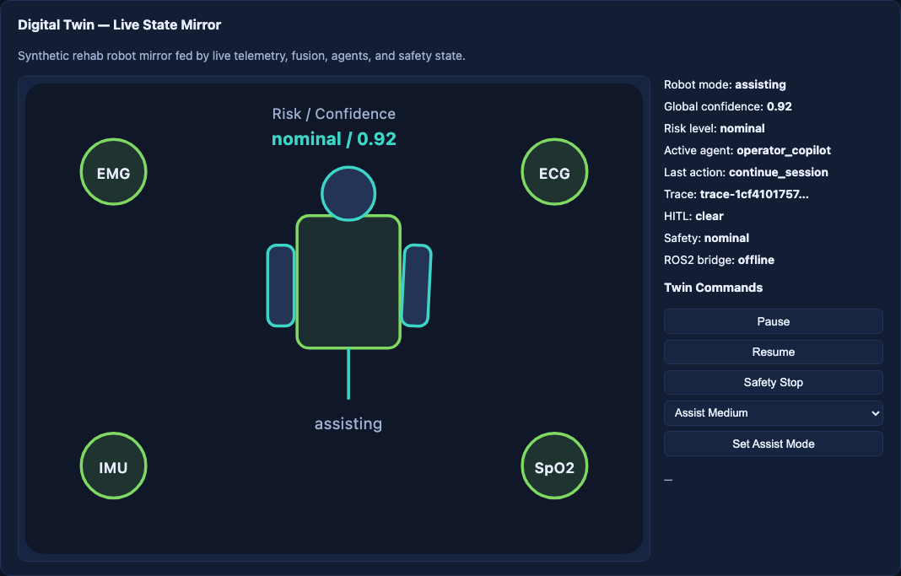
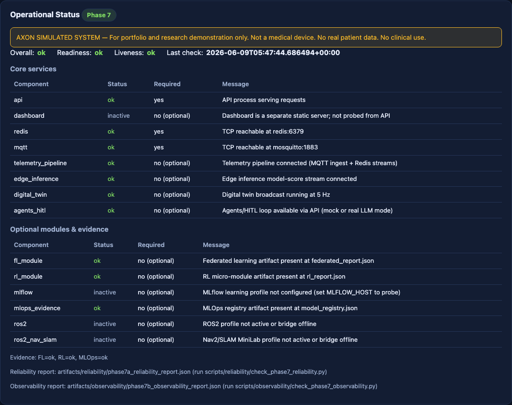
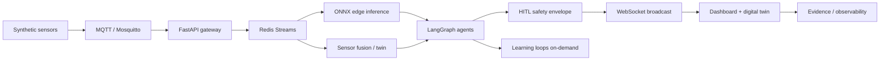

# AXON — Bio-Robotics Edge Command System

**Synthetic, local-first command system for simulated rehab robot operations.**

*Perceive. Decide. Learn. Operate.*

---

## Demo video

🎥 **Watch the AXON dashboard demo:** https://youtu.be/4LUz1CqIKAY

This walkthrough shows AXON running in its local core demo path: live synthetic telemetry, scenario controls, edge-inference signals, agent traces, safety / HITL flow, digital twin state mirror, and observability evidence.

---

## What is AXON?

AXON (Autonomous eXecution and Operations Network) is a **simulated-only, synthetic-only, local-first** intelligent systems project for **Simulated Rehab Robot Ops**. It is a full-stack command and evidence system — not a chatbot, not a static dashboard, and not a medical device.

The stack ingests synthetic biomedical-inspired telemetry (EMG, ECG-like, IMU, SpO2-proxy, robot state), runs **edge-like local inference** with ONNX Runtime, fuses operational state with confidence scoring, coordinates **safety-aware agents** with human-in-the-loop (HITL) gates, mirrors state in a **digital twin**, and collects **evidence** for observability, reliability, mission control, and learning loops (synthetic retraining / candidate refresh, federated learning, RL — on-demand where applicable).

> **Synthetic data only. No real patient data. No medical claims. Human review required for high-risk actions.**

---

## Demo snapshot

Evidence-backed screenshots from Phase 10A ([full index](docs/evidence/phase10/demo/screenshot-index.md)):

| Panel | Capture |
|-------|---------|
| Dashboard connectivity |  |
| Live synthetic telemetry |  |
| Agent traces and HITL |  |
| Digital twin mirror |  |
| Evidence / observability |  |

**Honest notes:** captures use the **`core` profile only**. ROS2/Nav2/SLAM appears as **offline / compose-validated** in screenshot 07 unless `ros2-nav-slam` is explicitly started. FL/RL/MLOps panels may be artifact-only unless on-demand scripts are run. Section crops (~1068px wide), not full-page — see [demo verification report](docs/evidence/phase10/demo/demo-verification-report.md).

---

## Why this project exists

AXON is a **portfolio technical demonstration** of how intelligent systems can **perceive, decide, learn, and operate** under real engineering constraints: local compute, modular activation, safety envelopes, and evidence governance. It shows applied AI systems engineering — event-driven architecture, edge inference, agent orchestration, observability, and honest scope boundaries — without pretending to be a regulated medical product or cloud-native enterprise deployment.

---

## System capabilities

| Area | What AXON demonstrates |
|------|------------------------|
| Telemetry | Real-time synthetic MQTT → API → Redis Streams → WebSocket → dashboard |
| Edge inference | ONNX Runtime scores on local streams (EMG anomaly, IMU movement, etc.) |
| Sensor fusion | Operational confidence aggregation (twin-side; standalone fusion service is a documented placeholder) |
| Mission control | Deterministic scenario runner, mission API, Evidence Center index |
| Agents & safety | LangGraph orchestration, LangChain tools/RAG layer, safety envelope, HITL |
| Digital twin | Live SVG state mirror with safe command API |
| Observability | Lightweight metrics, structured logs, health/live/ready endpoints |
| Evidence governance | Phase-gated checklists, verification scripts, claim scanner |
| Learning loops | Synthetic retraining / candidate refresh (classical models; not neural fine-tuning of a pretrained model) |
| FL / RL | Flower FedAvg and Gymnasium PPO micro-modules — **on-demand** (`learning` profile) |
| Robotics boundary | ROS2 thin adapter + Nav2/SLAM MiniLab — **compose-validated**; live runtime requires explicit profiles |

---

## Architecture



**Safety note:** the optional LLM copilot is **advisory** — it does not govern clinical actions or irreversible hardware commands. High-risk and low-confidence paths require human confirmation.

Deeper diagrams: [docs/architecture/](docs/architecture/) · Portfolio case study: [docs/portfolio/AXON_CASE_STUDY.md](docs/portfolio/AXON_CASE_STUDY.md)

---

## Local quickstart

### Prerequisites

- Docker Desktop or Docker Engine
- Python 3.12
- Git

### Setup and run (core profile)

```bash
python3.12 -m venv .venv
source .venv/bin/activate
pip install -e ".[dev,edge-ai,agents,mlops]"

# Required before Docker build — ONNX models are gitignored
make models-generate

docker compose --profile core up -d --build
```

Wait 30–60 seconds for MQTT, Redis, API health, and live telemetry.

### Verify

```bash
ASSUME_UP=true bash scripts/demo/phase10a_verify_demo.sh
```

| Service | URL |
|---------|-----|
| Dashboard | http://localhost:3000 |
| API health | http://localhost:8000/health |
| Telemetry status | http://localhost:8000/telemetry/status |

### Stop

```bash
docker compose --profile core down
```

### Re-capture screenshots (optional)

```bash
.venv/bin/pip install playwright
.venv/bin/playwright install chromium
.venv/bin/python scripts/demo/capture_phase10a_screenshots.py
.venv/bin/python scripts/demo/validate_phase10a_screenshots.py
```

Full runbook: [docs/evidence/phase10/demo/runbook-phase10a.md](docs/evidence/phase10/demo/runbook-phase10a.md)

For clean-machine reproduction from a fresh clone, see the [Fresh Clone Demo Checklist](docs/evidence/phase10/demo/fresh-clone-demo-checklist.md).

To drive the dashboard during a demo (panel-by-panel walkthrough, backend proof, button behavior map, guided demo mode), see the [Dashboard Demo Guide](docs/dashboard/DEMO_GUIDE.md).

---

## Evidence

| Artifact | Link |
|----------|------|
| Demo video | [YouTube walkthrough](https://youtu.be/4LUz1CqIKAY) |
| Screenshot index | [docs/evidence/phase10/demo/screenshot-index.md](docs/evidence/phase10/demo/screenshot-index.md) |
| Demo verification report | [docs/evidence/phase10/demo/demo-verification-report.md](docs/evidence/phase10/demo/demo-verification-report.md) |
| Demo runbook | [docs/evidence/phase10/demo/runbook-phase10a.md](docs/evidence/phase10/demo/runbook-phase10a.md) |
| Fresh clone checklist | [docs/evidence/phase10/demo/fresh-clone-demo-checklist.md](docs/evidence/phase10/demo/fresh-clone-demo-checklist.md) |
| Dashboard demo guide | [docs/dashboard/DEMO_GUIDE.md](docs/dashboard/DEMO_GUIDE.md) |
| Dashboard UX hardening report | [docs/evidence/phase10/dashboard-ux-hardening-report.md](docs/evidence/phase10/dashboard-ux-hardening-report.md) |
| Latest screenshots | [docs/evidence/phase10/demo/screenshots/latest/](docs/evidence/phase10/demo/screenshots/latest/) |
| Evidence Center index | [docs/evidence/README.md](docs/evidence/README.md) |
| Phase 9 final seal | [docs/evidence/phase9_final_seal_report.md](docs/evidence/phase9_final_seal_report.md) |
| Capability truth matrix | [docs/evidence/phase9_capability_truth_matrix.md](docs/evidence/phase9_capability_truth_matrix.md) |

**Phase 10A status:** **PASS WITH DOCUMENTED RISKS** — core demo automation, health checks, and 8/8 real screenshots verified. Risks include ROS2/Nav2 offline in core-only captures, on-demand FL/RL/MLOps artifacts, and `make models-generate` required on fresh clones.

---

## Execution profiles

Profiles prevent all subsystems from running at once. **Do not assume everything is live in `core`.**

| Profile | Purpose | Stability |
|---------|---------|-----------|
| `core` | API, dashboard, Redis, Mosquitto, sensor-generators, edge-inference | **Default demo path** |
| `obs` | Prometheus, Grafana (Phase 7) | On-demand |
| `learning` | MLflow, FL runner, RL runner | On-demand / artifact-only in core UI |
| `ros2` | ROS2 thin adapter | Compose-validated; requires explicit start |
| `ros2-nav-slam` | Nav2 + SLAM MiniLab (headless) | Compose-validated; heavy image |
| `sim` | Sensor simulation orchestrator | Optional |
| `llm` | Optional real LLM copilot | Not required; mock LLM is default |
| `full` | Union of profiles for late integration | Not the default demo |

```bash
make compose-config          # validate core
docker compose --profile core config
```

Details: [docs/architecture/profiles.md](docs/architecture/profiles.md)

---

## Safety and scope boundaries

- **Synthetic-only** biomedical-inspired signals — no real patient data
- **Simulated** rehab robot operations — operational anomaly detection only
- **Not** a medical device, diagnostic system, or treatment advisor
- **Not** for care-environment rollout, clinical decision-making, or regulatory product claims
- **Human-in-the-loop** for high-risk and low-confidence agent actions
- **MLOps wording:** synthetic retraining / candidate refresh loop for small classical models — not fine-tuning of a pretrained neural network

Policies: [docs/safety/](docs/safety/) · Positioning guide: [docs/portfolio/CLAIMS_AND_POSITIONING.md](docs/portfolio/CLAIMS_AND_POSITIONING.md)

---

## What this demonstrates technically

- Applied AI systems engineering across telemetry, inference, agents, and UI
- Edge/IoT event-driven architecture (MQTT, Redis Streams, WebSockets)
- Full-stack real-time dashboard with honest degradation modes
- Reliability and evidence governance (health gates, claim scanner, verification scripts)
- MLOps and learning-loop evidence without overstating always-on training
- Robotics software integration boundaries (thin ROS2 adapter, isolated Nav2 lab)
- Trade-off awareness under local compute and modular profile constraints

Technical Q&A: [docs/portfolio/TECHNICAL_QA.md](docs/portfolio/TECHNICAL_QA.md) · Business case: [docs/business/AXON_BUSINESS_CASE.md](docs/business/AXON_BUSINESS_CASE.md)

---

## Current status

| Milestone | Status |
|-----------|--------|
| Phases 1–8 | Merged (PR #14) |
| Phase 9 QA / hardening | Merged (PR #15–#17) |
| Phase 10A demo evidence | Merged (PR #18) — **PASS WITH DOCUMENTED RISKS** |
| Phase 10B portfolio packaging | Merged (PR #19) — **PASS WITH DOCUMENTED RISKS** |
| Phase 10C video / release prep | Pending — manual screen recording and release prep after 10C-1 audit |
| Release / tags / cloud | Not started — intentionally deferred |
| Enterprise production path | Documented roadmap only — AXON is **not** enterprise-production-ready today |

---

## Repository map

```
apps/api/                 FastAPI gateway, MQTT ingest, agents, twin, mission, health
apps/dashboard/           Live HTML/JS dashboard (telemetry, agents, twin, evidence)
services/                 edge-inference, sensor-generators, ROS2 bridge, Nav2 MiniLab
models/                   ONNX artifacts (generated locally — gitignored)
scripts/                  Verification, demo capture, MLOps/FL/RL runners
docs/evidence/            Evidence Center — checklists, phase reports, screenshots
docs/production/          Enterprise production path (planning only — not shipped)
docs/portfolio/           Case study, reusable copy, technical Q&A
docs/architecture/        Diagrams, event flow, profile strategy
docs/adr/                 Architecture decision records
tests/                    Schema, regression, claim-scan, phase gates
```

---

## Documentation index

| Document | Description |
|----------|-------------|
| [ROADMAP.md](ROADMAP.md) | Phased delivery plan |
| [PROJECT_CONTEXT.md](PROJECT_CONTEXT.md) | Contributor and agent context |
| [docs/portfolio/AXON_CASE_STUDY.md](docs/portfolio/AXON_CASE_STUDY.md) | Technical portfolio case study |
| [docs/portfolio/PORTFOLIO_COPY.md](docs/portfolio/PORTFOLIO_COPY.md) | Reusable portfolio copy |
| [docs/architecture/](docs/architecture/) | System diagrams |
| [docs/adr/](docs/adr/) | Architecture decision records |
| [docs/safety/](docs/safety/) | Safety policies |
| [docs/production/ENTERPRISE_PRODUCTION_PATH.md](docs/production/ENTERPRISE_PRODUCTION_PATH.md) | Enterprise hardening roadmap (not production-ready today) |
| [docs/business/AXON_BUSINESS_CASE.md](docs/business/AXON_BUSINESS_CASE.md) | Business case and staged transition context |

---

## License

MIT (see `pyproject.toml`).

---

*AXON — Simulated Rehab Robot Ops. Synthetic signals only. Not for clinical use.*
