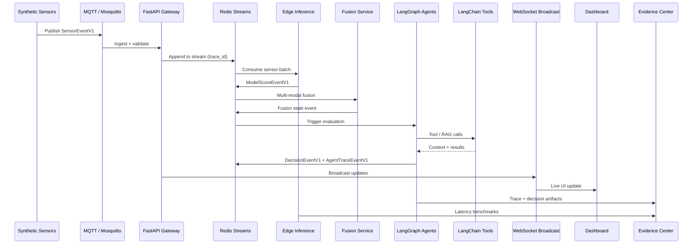
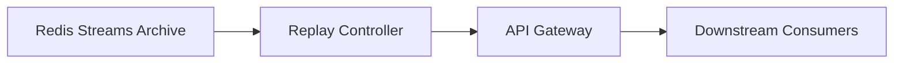

# Event Flow

End-to-end flow for synthetic telemetry through AXON to the dashboard and Evidence Center.

## Primary Flow

## Replay Mode (Future)

Replay re-emits historical events with preserved `trace_id` for deterministic debugging and demo reproduction.

## Trace ID Propagation

Every event carries a `trace_id` from first ingest through inference, fusion, agents, and dashboard broadcast. Downstream services must propagate the same `trace_id` unless spawning a child trace (documented in agent traces).

## Validation Gate

Validation occurs **before** inference:

1. Schema validation (Pydantic)
2. Quality/confidence bounds check
3. Missing/corrupt data flagged — never silently repaired without lowering confidence

## Phase 0 Note

Event flow is documented and schema contracts exist. No runtime pipeline is wired yet.
