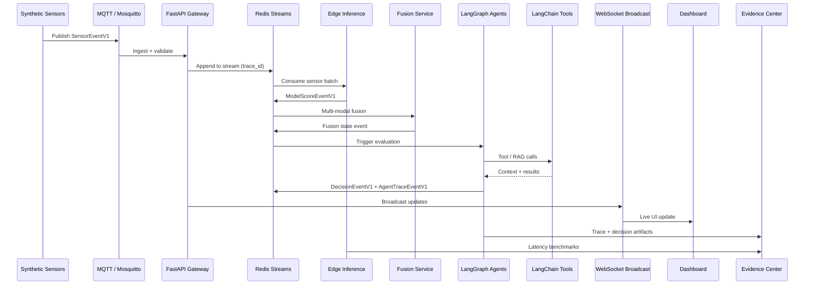
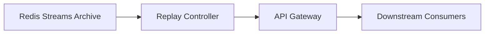
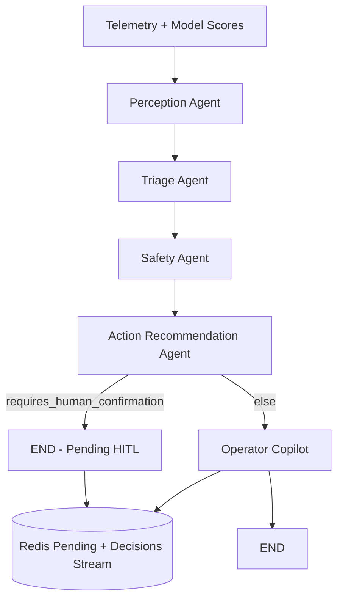

# Event Flow

End-to-end flow for synthetic telemetry through AXON to the dashboard and Evidence Center.

## Primary Flow

## Replay Mode (Future)

Replay re-emits historical events with preserved `trace_id` for deterministic debugging and demo reproduction.

## Trace ID Propagation

Every event carries a `trace_id` from first ingest through inference, fusion, agents, and dashboard broadcast. Downstream services must propagate the same `trace_id` unless spawning a child trace (documented in agent traces).

## Validation Gate

Validation occurs **before** inference:

1. Schema validation (Pydantic)
2. Quality/confidence bounds check
3. Missing/corrupt data flagged — never silently repaired without lowering confidence

## Phase 3 Runtime (Implemented)

Agent orchestration path under `core` profile (mock LLM default):

1. Agent loop in `api` lifespan reads telemetry + model score snapshots from Redis
2. LangGraph `StateGraph` executes: perception → triage → safety → action → (copilot if no HITL)
3. Safety Agent applies deterministic rules; LLM cannot override verdict fields
4. `AgentTraceEventV1` appended to `axon:v1:stream:agent_traces` per step
5. `DecisionEventV1` appended to `axon:v1:stream:decisions`
6. HITL pending decisions stored in Redis keys; confirm/reject via REST
7. WebSocket broadcast: `/ws/v1/agents`, `/ws/v1/decisions`, `/ws/v1/safety`
8. Dashboard shows traces, current decision, safety panel, HITL controls

Not yet implemented: sensor fusion, MLflow, ROS2, digital twin 3D.

## Phase 2 Runtime (Implemented)

The following path is live under the `core` Docker Compose profile:

1. `sensor-generators` publishes `SensorEventV1` to MQTT
2. `api` subscribes via aiomqtt, validates, appends to Redis Streams
3. `edge-inference` consumes EMG/IMU streams via XREAD BLOCK
4. ONNX Runtime CPU inference produces `ModelScoreEventV1`
5. Model scores appended to `axon:v1:stream:model_scores`
6. `api` model score watcher broadcasts to `/ws/v1/model-scores`
7. Dashboard shows live telemetry and model score panels

Not yet implemented: sensor fusion, agents, decision events.

## Phase 3 Agent Flow

## Phase 1 Runtime (Implemented)

The telemetry ingest path from Phase 1 remains active:

1. `sensor-generators` publishes `SensorEventV1` to MQTT
2. `api` subscribes via aiomqtt (background reconnect loop)
3. Events validated with Pydantic, appended to Redis Streams (MAXLEN ~1000)
4. WebSocket broadcast to dashboard at `ws://localhost:8000`
5. Replay via `replay/replay_publish.py` → MQTT (same ingest path)
