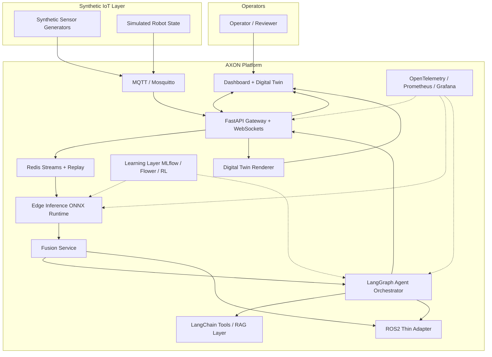

# System Context

AXON operates in a simulated rehabilitation robotics operations scenario. Operators interact through a dashboard while edge services process synthetic telemetry, run inference, coordinate agents, and emit evidence.

## Context Diagram

## Component Responsibilities

| Component | Responsibility | Phase |
|-----------|----------------|-------|
| Synthetic sensors | Generate biomedical-inspired telemetry | 1 |
| MQTT broker | Pub/sub ingress | 1 |
| API gateway | Validate, route, WebSocket broadcast | 1 |
| Redis Streams | Buffer, replay, consumer groups | 1 |
| Edge inference | ONNX Runtime scoring | 2 |
| Fusion | Multi-sensor state + confidence | 2 |
| Agent orchestrator | LangGraph stateful workflows | 3 |
| LangChain layer | Tools, RAG, retrievers | 3 |
| Learning | MLflow, synthetic retraining / candidate refresh loop, Flower, RL | 4, 6 |
| Observability | Traces, metrics, dashboards | 7 |
| ROS2 bridge | Robotics integration | 5, 5.5 |
| Digital twin | Live visualization | 5 |

## Phase 0 Note

Only the API health endpoint and schema contracts exist today. This diagram is the **target architecture**.
