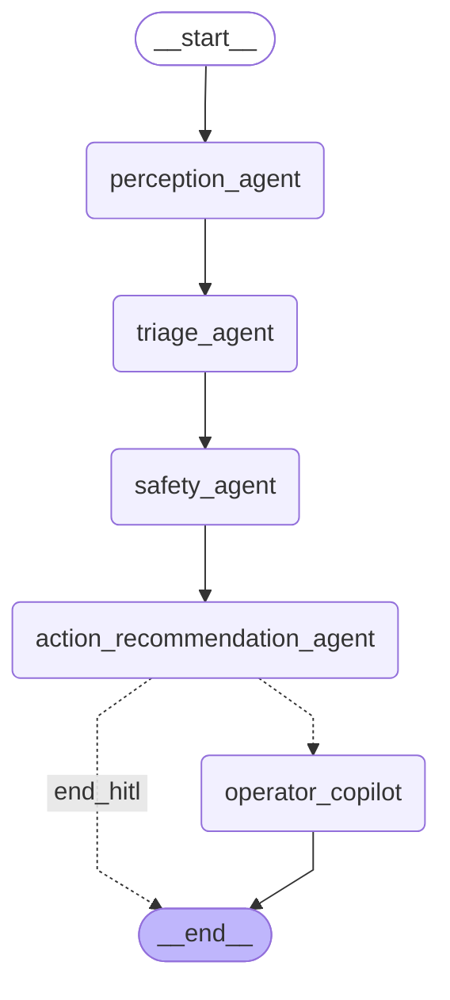

# AXON Phase 3 Agent Graph

```mermaid
---
config:
  flowchart:
    curve: linear
---
graph TD;
	__start__([<p>__start__</p>]):::first
	perception_agent(perception_agent)
	triage_agent(triage_agent)
	safety_agent(safety_agent)
	action_recommendation_agent(action_recommendation_agent)
	operator_copilot(operator_copilot)
	__end__([<p>__end__</p>]):::last
	__start__ --> perception_agent;
	action_recommendation_agent -. &nbsp;end_hitl&nbsp; .-> __end__;
	action_recommendation_agent -.-> operator_copilot;
	perception_agent --> triage_agent;
	safety_agent --> action_recommendation_agent;
	triage_agent --> safety_agent;
	operator_copilot --> __end__;
	classDef default fill:#f2f0ff,line-height:1.2
	classDef first fill-opacity:0
	classDef last fill:#bfb6fc

```
