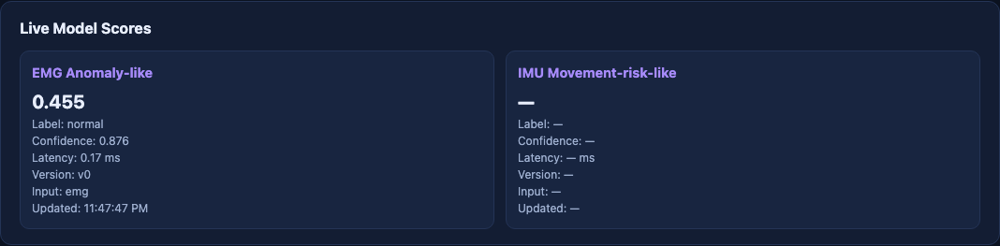
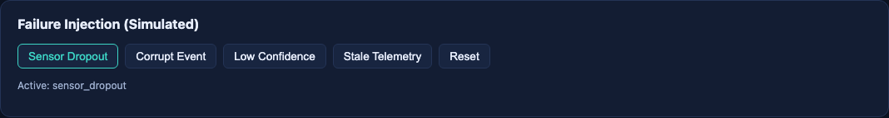
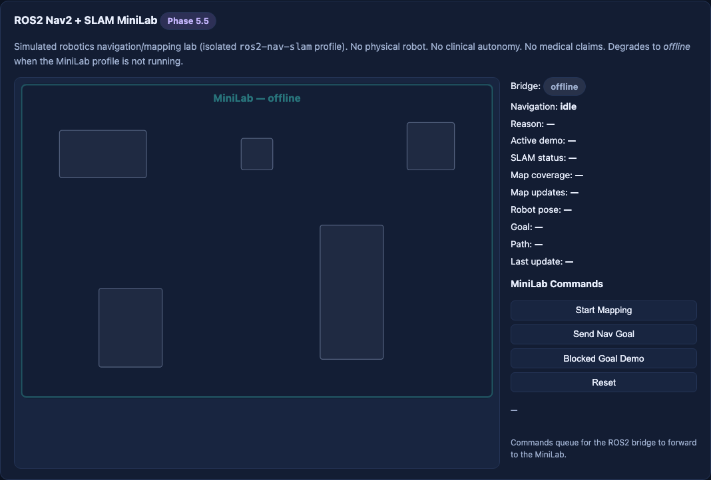

# Phase 10A Screenshot Index

Capture run: **20260609-054740** UTC  
Git SHA (pre-commit capture): `f8d5e1b643a122bf6197ecef9f3818f2933df841`  
Branch: `feat/phase-10a-demo-automation`  
Profile: `core` (api, dashboard, edge-inference, mosquitto, redis, sensor-generators)  
Command: `.venv/bin/python scripts/demo/capture_phase10a_screenshots.py`

| Screenshot | What it proves | Route / section | Notes |
|------------|----------------|-----------------|-------|
|  `00_dashboard_overview.png` | Live stack connectivity, WebSocket channel status, event counters | `http://localhost:3000/` `#connection-status` | API + sensor WebSockets online after warm-up |
|  `01_live_telemetry_streams.png` | Synthetic EMG, ECG-like, IMU, SpO2-proxy, robot-state live cards | `#live-telemetry` | Sparklines populated; scenario `normal_session` |
|  `02_edge_inference_and_fusion.png` | ONNX edge inference scores (EMG anomaly, IMU movement) | `#edge-inference` | Model score counter > 0; fusion via live scores |
|  `03_agent_traces_and_hitl.png` | LangGraph agent traces, safety/HITL decision panel | `#agent-traces` + decision panel above | Advisory LLM; HITL gates visible |
|  `04_digital_twin_state_mirror.png` | Digital twin SVG mirror of robot + sensor nodes | `#digital-twin` | 5 Hz twin broadcast from API |
|  `05_evidence_center_or_observability.png` | Phase 7 operational status + Phase 8 mission/evidence preview | `#operational-status`, `#mission-control` | Evidence Center lists committed + generated artifacts |
|  `06_failure_or_degraded_mode_if_available.png` | Simulated failure injection controls | `#failure-injection` | Sensor dropout clicked for demo state |
|  `07_ros2_nav_slam_compose_status_if_available.png` | Nav2/SLAM MiniLab panel **offline** under core-only | `#nav-slam` | Compose-validated; not live-gated without `ros2-nav-slam` profile |

## Metadata

Full machine-readable provenance: [screenshots/20260609-054740/capture-metadata.json](screenshots/20260609-054740/capture-metadata.json)

## Limitations

- Screenshots reflect **core profile only** — ROS2/Nav2/SLAM intentionally offline.
- No stock or AI-generated imagery; all captures from local Chromium headless against live dashboard.
- Thumbnails above use relative paths to `screenshots/latest/`.
- Captures are **section crops** (`data-testid` element screenshots), not full-page. Typical width ~1068px; height varies by panel. Validate with:

```bash
.venv/bin/python scripts/demo/validate_phase10a_screenshots.py
```
