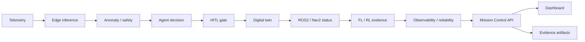

# Phase 8 — Integrated Mission Control System

## Purpose

Connect AXON's prior phases into one **mission control cockpit**: synthetic telemetry
→ edge inference → anomaly/safety → agent decision → HITL gate → digital twin →
robotics status → FL/RL evidence → observability/reliability → dashboard → evidence
artifacts.

This is an internal product-completion phase — not packaging, not cloud, not v0 release.

## Scope

- Unified Mission API (`/mission/*`)
- Deterministic scenario runner (seed 42, offline-capable)
- Mission timeline (API + artifacts + dashboard)
- Internal Evidence Center index (honest file scans)
- Dashboard Mission Control section (static HTML/JS/CSS)
- Phase 8 tests and `scripts/verify_phase8.sh`
- ADR-013, docs, evidence checklist updates

## Non-goals

- Phase 9 final QA or Phase 10 packaging
- Cloud, Kubernetes, VM deployment workflows
- Dashboard full redesign
- Heavy OpenTelemetry/Prometheus/Grafana requirement
- FL/RL retraining or live ROS2/Nav2/SLAM mandate
- Real biomedical data or medical/clinical claims

## Architecture flow



## Mission API endpoints

| Method | Path | Purpose | Fallback |
|--------|------|---------|----------|
| GET | `/mission/status` | Unified system snapshot | HTTP 200, `degraded: true` |
| GET | `/mission/timeline` | Ordered loop events | Deterministic fallback timeline |
| GET | `/mission/evidence` | Evidence Center index | Committed docs `missing`; generated artifacts `not_generated` |
| GET | `/mission/scenarios` | Scenario catalog | Static definitions |
| POST | `/mission/scenarios/run` | Run scenario | 400 for unknown scenario name |

All responses include `synthetic_data_only: true` and `no_medical_claims: true`.

Status cache TTL: `STATUS_TTL_S = 300`. Evidence index TTL: `EVIDENCE_TTL_S = 300`.

## Scenario determinism

Scenario *content* (synthetic telemetry values, stage ordering, `seed=42` labels) is
deterministic. `run_id`, `event_id`, and `generated_at` are runtime metadata by design —
they use `uuid4` and `datetime.now` and are not byte-reproducible across runs.

Runtime mission artifacts (`phase8_mission_*.json`, `phase8_scenario_summary.txt`) are
generated locally and are not committed. See `docs/evidence/phase8_snapshot_note.md`.

`POST /mission/scenarios/run` returns `persisted: false` with a `persistence_note` when
the artifact path is read-only (e.g. Docker `core` profile `:ro` mount) instead of
silently claiming persistence succeeded.

## Scenario runner usage

```bash
python scripts/run_phase8_mission_scenario.py --scenario normal_operation
python scripts/run_phase8_mission_scenario.py --scenario anomaly_safety_intervention
python scripts/run_phase8_mission_scenario.py --scenario learning_evidence_review
bash scripts/verify_phase8.sh
```

Scenarios:

1. **normal_operation** — nominal synthetic loop → evidence write
2. **anomaly_safety_intervention** — elevated synthetic signals → HITL gate
3. **learning_evidence_review** — FL/RL evidence connectivity without retraining

## Artifacts

Written to `artifacts/phase8/`:

- `phase8_mission_status.json`
- `phase8_mission_timeline.json`
- `phase8_mission_evidence_index.json`
- `phase8_scenario_<scenario>_<run_id>.json`
- `phase8_scenario_summary.txt`

Required fields on every JSON artifact: `run_id`, `scenario`, `generated_at`,
`synthetic_data_only`, `no_medical_claims`, `limitations`, `seed` (42).

## Dashboard changes

New **Mission Control** section in `apps/dashboard/index.html`:

- Summary cards (mode, run ID, degraded flag)
- Component cards for telemetry → evidence loop
- Timeline table
- Evidence Center preview
- Scenario runner buttons (POST to API with offline script fallback)

Poll interval: **10 seconds**. If `/mission/status` fails, shows
"Mission API unavailable" — never fake healthy statuses.

## Lightweight checks

```bash
pytest tests/phase8/ -q
make test   # full regression if feasible
docker compose --profile core config
curl -s http://localhost:8000/mission/status | python3 -m json.tool
```

## Limitations

- Optional ROS2/Nav2/SLAM profiles may be offline; stages marked `skipped`.
- Runtime `ok` only when in-process state or fresh artifacts verify connectivity.
- Scenario runner does not require Docker services; live enrichment is best-effort.
- Evidence index reports historical artifacts as `available` (may be `stale: true`).

## No medical claims

AXON Phase 8 uses **synthetic biomedical-inspired signals only**. The mission control
layer produces operational simulation evidence — not diagnosis, treatment, or clinical
recommendations.

## Next phase

**Phase 9** — final QA, repair, hardening, and senior verification before packaging (Phase 10).
