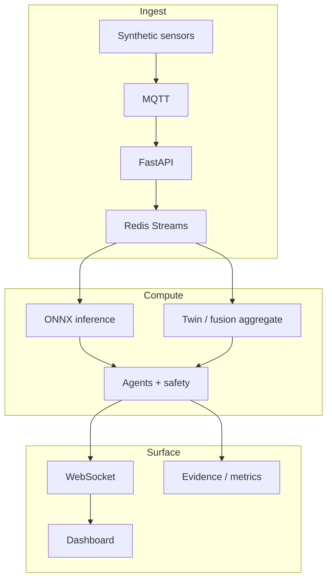

# AXON — Technical Portfolio Case Study

**Bio-Robotics Edge Command System · Simulated Rehab Robot Ops**

---

## 1. Executive summary

AXON is a **synthetic-only, local-first** command system that demonstrates how edge AI, IoT telemetry, safety-aware agents, digital twin visualization, observability, and evidence governance fit together in a single reproducible stack. It targets **simulated rehabilitation robot operations** — operational anomaly detection and mission coordination — with no clinical claims, no real patient data, and no care-environment rollout narrative.

Phase 10A produced **real screenshot evidence** and automated health verification on the `core` profile. Status: **PASS WITH DOCUMENTED RISKS**.

---

## 2. Problem framing

Portfolio reviewers and interviewers often see isolated demos: a chat UI, a single model endpoint, or a dashboard without a spine. AXON was built to show **systems thinking** — how data moves from synthetic sensors through buffering, inference, fusion, agent decisions, human gates, UI, and evidence artifacts — while staying honest about what is live, on-demand, or compose-validated only.

The scenario is fixed: a simulated rehab robot context with biomedical-inspired **synthetic** streams (EMG, ECG-like, IMU, SpO2-proxy) plus robot-state telemetry. The engineering question is credible, safety-bounded operations control under synthetic inputs.

---

## 3. Constraints

| Constraint | How AXON handles it |
|------------|---------------------|
| **Local-first** | Docker Compose profiles; no mandatory cloud, Kubernetes, or VM |
| **Synthetic-only** | Generators and replay scenarios; no real patient data |
| **No medical claims** | Claim scanner, safety policies, explicit disclaimers in UI and docs |
| **Modest hardware** | Small ONNX models, classical MLOps path, on-demand FL/RL |
| **Reproducibility** | `make models-generate`, verify scripts, timestamped screenshot captures |
| **Honest scope** | ROS2/Nav2 compose-validated unless profile started; FL/RL artifact-only in core UI |

---

## 4. System design

End-to-end flow:

1. **Synthetic sensors** publish Pydantic-validated events to MQTT.
2. **FastAPI gateway** ingests, validates, and appends to **Redis Streams**.
3. **Edge inference service** scores streams with **ONNX Runtime**.
4. **Twin and mission layers** aggregate operational state and confidence.
5. **LangGraph agents** (LangChain tools/RAG) propose actions inside a **safety envelope**.
6. **HITL** gates high-risk / low-confidence paths.
7. **WebSockets** push live updates to the dashboard and **digital twin**.
8. **Evidence Center** indexes committed and generated artifacts with existence checks.
9. **Learning loops** (MLOps, FL, RL) run **on-demand** via Make targets and `learning` profile.

---

## 5. Key technical decisions

### MQTT + Redis Streams

MQTT fits lightweight pub/sub from many synthetic sensor topics. Redis Streams provide durable buffering, replay alignment, and stream-length proofs without pulling Kafka into a local portfolio stack.

### FastAPI + WebSockets

A single async gateway exposes health, mission, twin, and learning status APIs while broadcasting live channels to a static HTML/JS dashboard — fast to demo, easy to verify with curl and Playwright.

### ONNX / edge-like inference

Small models score EMG and IMU-like features locally. "Edge-like" here means **on-machine inference in the compose stack**, not a claim about deployed medical edge hardware.

### Sensor fusion

Standalone `fusion-service` remains a documented placeholder. Operational confidence aggregation happens in the **twin path** — claims stay partial and truthful (see Phase 9 capability matrix).

### Safety-aware agents and HITL

LangGraph orchestrates agent steps; LangChain supplies tools and retrieval. The safety module and `requires_human_confirmation` decision events enforce that automation does not silently execute high-risk actions. The optional LLM is **advisory**, not an autonomous clinical controller.

### Docker Compose profiles

`core`, `obs`, `learning`, `ros2`, `ros2-nav-slam`, and `full` stage heavy dependencies. The default demo path is **`core` only** — reviewers should not infer Nav2 or FL are always running.

### Evidence Center

Mission and observability panels surface an evidence index with honest `not_generated` states for on-demand artifacts. Phase 9 sealed integrity: runtime-generated scenario JSONs are not committed as source truth.

### ROS2 / Nav2 / SLAM boundary

Thin ROS2 bridge and a headless Nav2 + SLAM MiniLab exist and **compose-validate**. Live navigation screenshots require explicitly starting `ros2-nav-slam`. Phase 10A screenshot 07 shows the MiniLab panel **offline** under core-only — by design.

---

## 6. Demo path

Phase 10A evidence (merged PR #18):

| Step | Command / artifact |
|------|-------------------|
| Start stack | `make models-generate && docker compose --profile core up -d --build` |
| Verify | `ASSUME_UP=true bash scripts/demo/phase10a_verify_demo.sh` |
| Screenshots | `.venv/bin/python scripts/demo/capture_phase10a_screenshots.py` |
| Index | [screenshot-index.md](../evidence/phase10/demo/screenshot-index.md) |
| Report | [demo-verification-report.md](../evidence/phase10/demo/demo-verification-report.md) |

Capture run: `20260609-054740` UTC · 8/8 PNGs in `screenshots/latest/`.

---

## 7. Reliability and evidence

- **Health:** `/health`, `/health/live`, `/health/ready`, `/status/services`
- **Observability:** Prometheus-compatible `/metrics`, structured JSON logs, trace IDs
- **Verification:** `scripts/verify_phase9.sh`, `scripts/scan_claims.py`, Phase 10A demo scripts
- **Regression:** pytest suite across schemas, agents, twin, mission, claim negation cases
- **Status:** Phase 10A **PASS WITH DOCUMENTED RISKS** — not a blanket "production-ready" claim

---

## 8. Learning loops

### Synthetic retraining / candidate refresh

Phase 4 MLOps implements a **classical** train/eval/promote loop for small candidate models. Wording is intentional: this is not fine-tuning of a pretrained neural network. Drift detection can recommend retrain; artifacts appear on demand.

### FL / RL on-demand

- **Federated learning:** Flower FedAvg simulation with tiny CPU MLPs — `learning` profile / `make learning-fl-run`
- **RL micro-module:** Gymnasium + Stable-Baselines3 PPO for operational triage simulation — on-demand only

Dashboard panels may show idle or artifact-only states until these scripts run locally.

---

## 9. What I would improve next

These are engineering extensions, not admissions that the current artifact lacks value:

1. **Optional cloud path** — remote artifact store or hosted demo, still synthetic-only
2. **Richer replay scenarios** — more edge cases for fatigue, dropout, and mission stress tests
3. **Dashboard visual polish** — without changing the honest static-HTML architecture story
4. **On-demand profile demo scripts** — one-command FL/RL/Nav2 evidence refresh for reviewers
5. **Stronger fusion subsystem** — replace placeholder service with explicit fusion contracts if scope expands

---

## 10. Interview narrative

When discussing AXON, I lead with **scope and evidence**:

- It is a **simulated operations stack** with real integration depth locally.
- I chose **profiles over always-on complexity** so reviewers can reproduce the core demo in minutes.
- I invested in **evidence governance** because portfolio claims without proof erode trust.
- I separated **compose-validated robotics** from **live-gated core demo** so Nav2 honesty is visible in screenshots.
- The LLM is a **copilot inside a safety envelope**, not the system brain for irreversible actions.

Trade-offs worth noting: static dashboard vs SPA build pipeline (faster reproducibility); classical MLOps vs large pretrained-model adaptation (appropriate for synthetic portfolio scope); headless Nav2 lab vs Gazebo (CI-friendly, no hardware fiction).

---

*Related: [PORTFOLIO_COPY.md](PORTFOLIO_COPY.md) · [TECHNICAL_QA.md](TECHNICAL_QA.md) · [Evidence Center](../evidence/README.md)*
